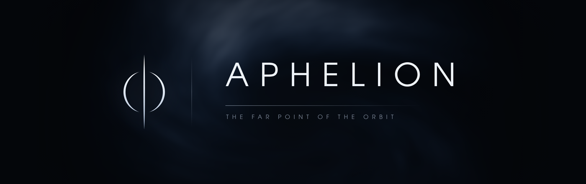
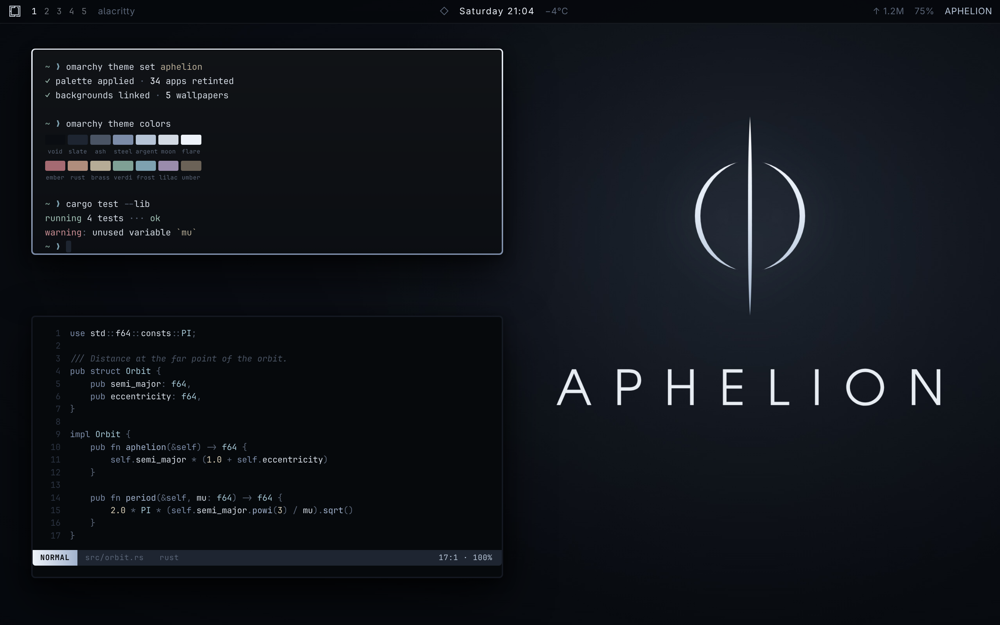
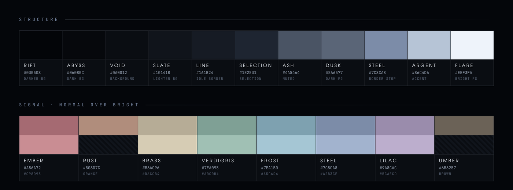
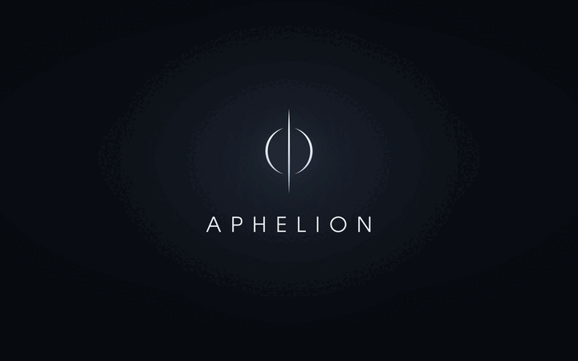
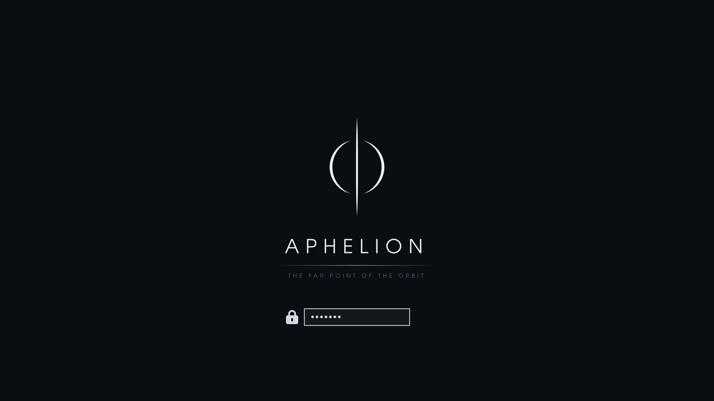

<div align="center">



**Silver on void.** A dark theme for [Omarchy](https://omarchy.org) — near-black with a blue
cast, cold silver for the accent, and colour held back until it has something to say.

`Omarchy 4` · `dark` · `5 wallpapers at 4K` · `MIT`

</div>

---

Aphelion is the point in an orbit farthest from the star it circles — the coldest, slowest,
quietest place a body ever reaches. The theme is built at that distance.

It starts where solitude stops: same restraint, same window geometry, but the neutrals are
pulled cold and blue rather than warm, and the highlights go to a true specular white.

## Install

```bash
omarchy theme install https://github.com/itsmoorgrove/omarchy-aphelion-theme.git
```

That clones into `~/.config/omarchy/themes/aphelion` and applies it straight away.
Switching back later:

```bash
omarchy theme set aphelion
```

Wallpapers cycle with `omarchy theme bg next`, or pick one from the background switcher on
`SUPER + CTRL + SPACE`. For the boot splash:

```bash
omarchy plymouth set-by-theme aphelion
```

## The desktop



The focused window is outlined by a 90° gradient, specular white to steel — the same fall
of light the sigil makes. The inactive border drops to `#161b24` at 67% alpha, so attention
follows the light rather than the frame.

`rounding = 6`, `rounding_power = 3`, matched to solitude exactly.

## Palette



Fourteen colours carry the whole desktop. Everything sits under twenty percent saturation,
so syntax reads as tone before it reads as hue. Ember is the one colour allowed to feel
warm, and it is reserved for things that are actually wrong.

| | Hex | |
|---|---|---|
| Background | `#0a0d12` | |
| Dark background | `#06080c` | |
| Darker background | `#030508` | |
| Lighter background | `#10141b` | |
| Foreground | `#d3dae3` | |
| Bright foreground | `#eef3fa` | |
| Accent | `#b6c4d6` | argent |
| Selection | `#1e2531` | |
| Muted | `#4a5464` | |

| ANSI | Normal | Bright |
|---|---|---|
| red | `#a56a72` | `#c98d93` |
| green | `#7fa095` | `#a0c0b4` |
| yellow | `#b6ac96` | `#d6ccb4` |
| blue | `#7c8ca8` | `#a2b3ce` |
| magenta | `#9a8cac` | `#bcaecd` |
| cyan | `#7ea1b0` | `#a5c6d4` |
| white | `#d3dae3` | `#eef3fa` |

Plus `orange #b08d7c` and `brown #6b6257`.

## Wallpapers

Five, 3840×2160, generated against this palette rather than sourced. Omarchy picks the
first one alphabetically on a fresh activation, so `1-ensign` is what you land on.



| | |
|---|---|
| `1-ensign` | the mark and the wordmark, alone — the default |
| `2-aphelion` | the sigil over a reflecting plain, horizon burst below |
| `3-eclipse` | the sigil centred in a swirling nebula |
| `4-monolith` | the sigil as pure geometry against soft weather |
| `5-void` | 0.7% mean luminance, for OLED |

The sigil is composited at or below its native resolution in every plate, so the
crystalline edge stays sharp rather than turning to mush.

## Boot splash



`unlock.png` and the palette become the Plymouth boot screen — flat ground, the lockup,
and on an encrypted disk a password entry 40px below it. No clock, no chrome. The same
logo and colours are pushed to the SDDM login screen at the same time.

## What's in here

```
colors.toml          palette
hyprland.lua         border gradient, rounding, shadow
icons.theme          Yaru-blue-dark
backgrounds/         five wallpapers
unlock.png           Plymouth boot logo
preview.png          theme switcher preview
preview-unlock.png   Plymouth switcher preview
preview.gif          background cycle, for this README
docs/                banner and palette plates, for this README
build/               sources and generators
```

`colors.toml` drives everything else. Omarchy generates the alacritty, foot, kitty,
ghostty, btop, neovim, helix, vscode, obsidian, chromium and shell configs from it, so
they're not checked in here. Shipping a `shell.toml` or `neovim.lua` would pin those
surfaces to whatever Omarchy looks like today and stop them picking up upstream changes.

Icons use `Yaru-blue-dark` from `yaru-icon-theme`, which the stock themes already depend
on.

## Rebuilding

Nothing here is hand-painted. The wallpapers, previews and README plates are all generated:

```bash
bash build/all.sh
```

Needs `imagemagick`, `librsvg` and `chromium`. Every stage is seeded, so a rebuild
reproduces the same output. Individual stages run on their own once `build/00-prepare.sh`
has been through once.

```
build/sigil.svg                the mark as geometry, renders at any size
build/unlock.svg               the boot lockup
build/preview.html             the desktop mock behind preview.png
build/wallpaper-ensign.html    the wordmark plate
build/banner.html              the banner at the top of this file
build/palette.html             the palette plate above
build/src/                     the two source plates the sigil texture comes from
```

`build/` comes along when the repo is cloned as a theme. Nothing in Omarchy reads it.

## License

MIT. See [LICENSE](LICENSE).
